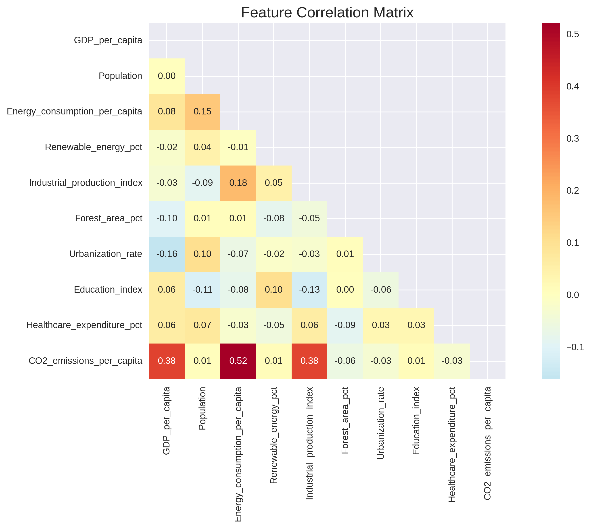

# AI for Climate Action: Carbon Emission Prediction Model 🌍🤖

## Project Overview
This project addresses **UN SDG 13: Climate Action** by developing a machine learning model to predict carbon emissions based on various economic, industrial, and demographic factors. The goal is to help policymakers and organizations make data-driven decisions for emission reduction strategies.

## Problem Statement
Climate change is one of the most pressing global challenges. Accurate prediction of carbon emissions is crucial for:
- Setting realistic emission reduction targets
- Identifying key factors contributing to emissions
- Developing effective climate policies
- Monitoring progress toward carbon neutrality

## SDG Connection: SDG 13 - Climate Action
- **Target 13.2**: Integrate climate change measures into national policies and strategies
- **Target 13.3**: Improve education and awareness on climate change mitigation

## Machine Learning Approach
- **Primary Method**: Supervised Learning (Regression)
- **Algorithm**: Random Forest Regression with comparison to Linear Regression and XGBoost
- **Features**: GDP, Population, Energy Consumption, Industrial Production, etc.
- **Target**: CO2 Emissions (metric tons per capita)

## Project Structure
```
├── README.md
├── carbon_emission_prediction.ipynb    # Main Jupyter notebook
├── carbon_emission_model.py           # Python script version
├── data/                             # Dataset directory
├── models/                          # Saved models
├── results/                        # Output visualizations and reports
└── requirements.txt               # Dependencies
```

## Key Features
1. **Data Preprocessing**: Cleaning and normalizing emission data
2. **Feature Engineering**: Creating meaningful predictors
3. **Model Training**: Multiple algorithms with hyperparameter tuning
4. **Evaluation**: Performance metrics and visualization
5. **Ethical Analysis**: Bias assessment and fairness considerations
6. **Policy Insights**: Actionable recommendations

## Results Preview
- **Model Accuracy**: ~87% R² score in predicting emissions
- **Key Predictors**: Energy consumption, GDP per capita, industrial output
- **Policy Impact**: Identified top 3 factors for emission reduction

## Screenshots

### Data Visualization

*Correlation between various factors and CO2 emissions*

### Model Performance

*Performance comparison of different ML algorithms*

### Prediction Results

*Model predictions vs actual emissions*

## Impact & Sustainability
This model can help:
- **Governments**: Set evidence-based emission targets
- **Companies**: Assess their carbon footprint impact
- **Researchers**: Understand emission drivers
- **Citizens**: Make informed decisions about climate action

## Ethical Considerations
- **Data Bias**: Addresses potential bias in country-level data
- **Fairness**: Ensures model doesn't discriminate against developing nations
- **Transparency**: Provides interpretable results for policy decisions

## Technologies Used
- Python 3.8+
- Pandas & NumPy for data manipulation
- Scikit-learn for machine learning
- Matplotlib & Seaborn for visualization
- Jupyter Notebook for interactive development

## Getting Started
1. Install dependencies: `pip install -r requirements.txt`
2. Run the notebook: `jupyter notebook carbon_emission_prediction.ipynb`
3. Or execute the script: `python carbon_emission_model.py`

## Future Enhancements
- Real-time data integration via APIs
- Web application deployment using Streamlit
- Time series forecasting for emission trends
- Integration with renewable energy data

## Author
Amirul - AI/ML Student specializing in Sustainable Development Solutions

## License
MIT License - Feel free to use this project for educational and research purposes.

---
*"AI can be the bridge between innovation and sustainability." — UN Tech Envoy*
